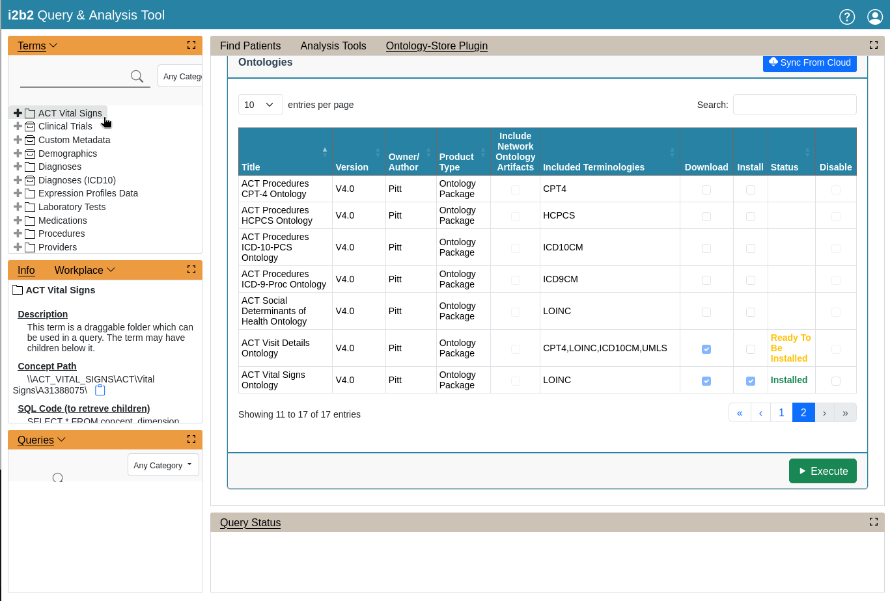

# ontology-store

An i2b2 plug-in providing the following functionalities:

- Downloading i2b2 formatted ontologies, hosted on the Amazon S3 cloud, onto the server.
- Importing the downloaded ontologies and data into an i2b2 database.

## ontology-store-ws

The **ontology-store-ws** is the Ontology-Store REST API for retrieving a list ontologies host on Amazon S3 cloud, for downloading the ontologies, and for importing the ontologies into an i2b2 database.

### Building the REST API

#### Prerequisite
- [OpenJDK 8](https://developers.redhat.com/products/openjdk/download)
- [Apache Maven 3.x.x](https://maven.apache.org/download.cgi)


#### Setting the Ontology Download Location

The location where the ontologies will be downloaded to on the server is specified in the **application.properties** file located in the project folder ***ontology-store-ws/src/main/***.  Set the ***ontology.dir.download*** property to the path of the location.  For an example, if the download location on your server is ***/home/wildfly/download***, the **application.properties** should be to the following:

```properties
ontology.dir.download=/home/wildfly/download

aws.s3.json.product.list=https://ontology-store.s3.amazonaws.com/product-list.json

# ontology json files
ontology.aws.s3.bucket.name=ontology-store
ontology.aws.s3.key.name=products

# network files
network.aws.s3.bucket.name=act-ontology-v4-test
network.aws.s3.key.name=network_files

# CRC datasource
spring.datasource.jndi-name=java:/OntologyBootStrapDS
```

#### Building the REST API WAR File

Open a terminal in the project folder ***ontology-store-ws***.  Execute the following command to run Apache Maven to build the war file:

```
mvn clean package
```

The war file, **ontology-store.war**, is located in the project folder ***ontology-store-ws/target***.

### Deploying the WAR File

The Ontology-Store REST API must be running in the same Servlet container as the i2b2 Hive.  The REST API shares the JNDI database configuration as the i2b2 Hive.

1. Stop Wildfly.
2. Copy the **ontology-store.war** file to Wildfly's **deployments** folder.
3. Start Wildfly.

> Note that the instructions above require administrative privileges.

## OntologyStore

An i2b2 plug-in that allow users to download ontologies and import them into an i2b2 database by making API calls to the Ontology-Store REST API.

### Installing the Plug-in

#### Copy the Plug-in to the i2b2 Web Client

Copy the folder **OntologyStore** located in the project folder **ontology-store** to the directory ***js-i2b2/cells/plugins/standard*** of the i2b2 web client.

#### Registering the Plug-in

Registering the plug-in with the web client framework by adding an entry to the module loader configuration file **i2b2_loader.js** located in the folder ***webclient/js-i2b2***.  Add the following code to the **i2b2.hive.tempCellsList**:

```js
{code: "OntologyStore",
    forceLoading: true,
    forceConfigMsg: {params: []},
    forceDir: "cells/plugins/standard"
}
```

The **i2b2_loader.js**  should look similar to this:

```js
i2b2.hive.tempCellsList = [
    {code: "PM",
        forceLoading: true 			// <----- this must be set to true for the PM cell!
    },
    {code: "ONT"},
    {code: "CRC"},
    {code: "WORK"},
    ...
    {code: "OntologyStore",
        forceLoading: true,
        forceConfigMsg: {params: []},
        forceDir: "cells/plugins/standard"
    }
];
```

For more information on installing the plug-in, please visit [Web Client Plug-in Developers Guide](https://community.i2b2.org/wiki/display/webclient/Web+Client+Plug-in+Developers+Guide).

## Using the Plug-in

The plug-in requires users to have i2b2 administrative privileges.

1. Log on to the i2b2 web client as an **administrator**.
2. Click on the ***Analysis Tools*** drop-down and select the **Ontology Store**.
    
3. Click on the icon ***Sync From Cloud*** to retrieve a list of ontologies from AWS to download/install.
    
4. Select the ontology to download and install by checking the checkboxes and click the ***Execute*** button.
    
5. A spinner will show while tasks are in progress.
    
6. Once the task is done, a summary of the task will pop up.
    
7. Log out and log back in.  You will see the installed ontologies.
    
