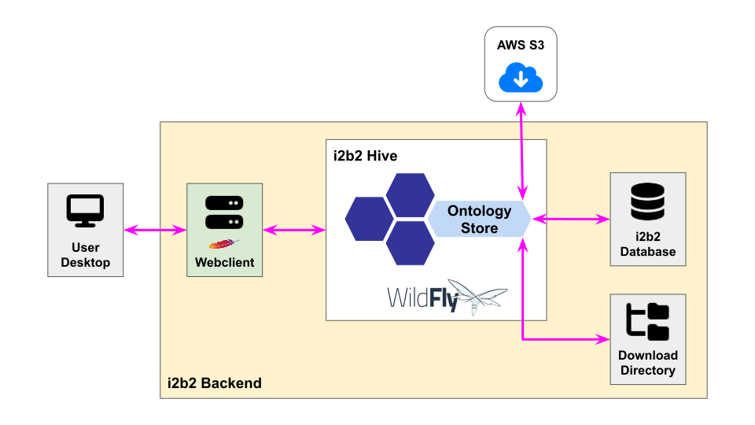
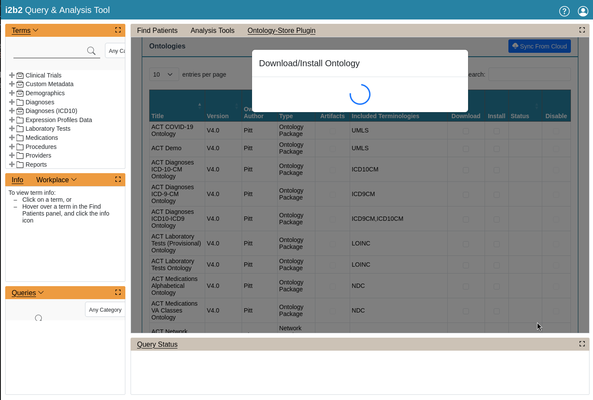

# ontology-store

An i2b2 administrative tool for downloading and installing ontologies hosted on a cloud.

<figure>
    
    <figcaption align="center">
        <b>Fig. 1 - Ontology Store Flow</b>
    </figcaption>
</figure>

The software consists of the following software components:

- [i2b2-ontologystore](cell), a backend API (i2b2 cell).
- [OntologyStore](plugin), a frontend client (i2b2 plug-in).

## Installing the Software

- [Quick installation guide](docs/QUICK_INSTALL_i2b2_1.8.2.md).

## Using the Software

The plug-in requires users to have i2b2 **administrative privileges**.

1. Log on to the i2b2 web client as an administrator.

2. Click on the ***Analysis Tools*** link.

3. Scroll down the list until you see the **Ontology-Store Plugin**.  Click on it.

4. Select the ontology to download and install by checking the checkboxes and click the Execute button.  For example, we will download and install the ***ACT Vital Signs Ontology*** and just download the ***ACT Visit Details Ontology***.

5. A spinner will show while the tasks are in progress.

6. Once the task is done, a summary table of the tasks will pop up.

7. You will see that the ***ACT Vital Signs Ontology*** has been successfully installed and the ***ACT Visit Details Ontology*** has been successfully downloaded.
