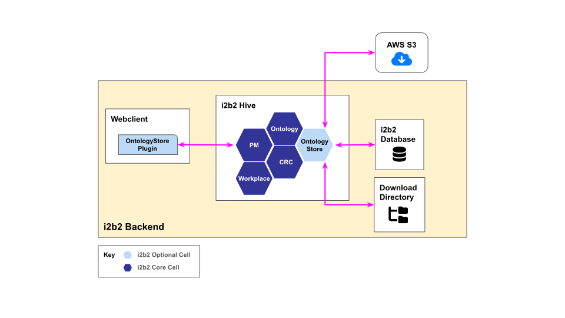

# OntologyStore

OntologyStore is an administrative tool that enables i2b2 administrator to download ontologies hosted on the cloud and to import them into the i2b2 database.

OntologyStore consists of the following components:

- The OntologyStore cell - assists in fetching the list of ontologies from the cloud, download the
ontologies onto a storage location and installing the downloaded ontologies.

- The OntologyStore webclient plugin - assists in displaying the list of ontologies, selecting
ontologies to download and install, and hiding (disabled) installed ontologies.

<figure>
    
    <figcaption><b>Figure 1: </b>OntologyStore Flow Diagram</figcaption>
</figure>

## Ontology Files

The ontology consists of the following tab-delimited (tsv) files.

- **Metadata**: A new metadata table will be created for importing the data. The filename will be used as the table name.
- **Concept Dimension**: A new concept dimension table will be created for importing the data. The filename suffixed with _cd will be used as the table name. To run queries, the data must be copied over to the main i2b2 ***CONCEPT_DIMENSION*** table.
- **Schemes**: Data will be directly imported into the i2b2 ***SCHEMES*** table.
- **Table Access**: Data will be directly imported into the i2b2 ***TABLE_ACCESS*** table.

## Ontology Package

The ontology package is a zip file containing the ontology files along with a JSON file called ***package.json***.

The package.json tell the OntologyStore cell which files are the metadata files, which files are the concept  dimension files, and etc.

```json
{
    "tableAccess": [
        "table_access/TABLE_ACCESS.tsv"
    ],
    "schemes": ["metadata/SCHEMES.tsv"],
    "breakdownPath": ["crc/QT_BREAKDOWN_PATH.tsv"],
    "conceptDimensions": [
        "crc/ACT_COVID_V4_CD.tsv",
        "crc/ACT_CPT4_PX_V4_CD.tsv",
        "crc/ACT_DEM_V4_CD.tsv"
    ],
    "domainOntologies": [
        "metadata/ACT_COVID_V4.tsv",
        "metadata/ACT_CPT4_PX_V4.tsv",
        "metadata/ACT_DEM_V4.tsv"
    ]
}
```
<figure>
    <figcaption><b>Figure 2: </b>An example of package.json</figcaption>
</figure>

## Ontology Product

The ontology product is a JSON object containing the description of the ontology and the URL to download the ontology package.

The ontology product contains the following information (attributes):

| Attribute      | Description                                                  | Required |
|----------------|--------------------------------------------------------------|----------|
| id             | A unique name for the ontology.                              | Yes      |
| title          | Full name of the ontology.                                   | Yes      |
| version        | The release version of the ontology.                         | Yes      |
| owner          | The author/creator of the ontology file.                     | Yes      |
| type           | The specific usage for the ontology.                         | Yes      |
| networkFiles   | An array of URLs that point to the network files for Shrine. | No       |
| terminologies  | The list of terminologies describing the ontology.           | No       |
| file           | The URL pointing to the ontology package file.               | Yes      |
| sha256Checksum | Sha256 checksum for the ontology package file.               | Yes      |

```json
{
    "id": "act_network_ontology_v4",
    "title": "ACT Network Ontology",
    "version": "V4",
    "owner": "Pitt",
    "type": "Network Ontology Package",
    "networkFiles": ["https://act-ontology-v4-test.s3.amazonaws.com/network_files/AdapterMappingV4.zip"],
    "terminologies": ["CPT4", "LOINC", "ICD10CM", "UMLS"],
    "file": "https://ontology-store-v2.s3.amazonaws.com/products/act_network_ontology_v4.zip",
    "sha256Checksum": "ee11f40630bae3fb87dac755c6ddbe7cd73594ada5d4991ebd559de27351f014"
}
```
<figure>
    <figcaption><b>Figure 3: </b>An example of an ontology product</figcaption>
</figure>


## Ontology Product List

The Ontology product list is a JSON object containing a list of the ontology products.  This is what the OntologyStore cell fetches to get the list of onotologies.

```json
{
    "products": [
        {
            "id": "act_covid_v4",
            "title": "ACT COVID-19 Ontology",
            "version": "V4",
            "owner": "Pitt",
            "type": "Ontology Package",
            "networkFiles": null,
            "terminologies": ["UMLS"],
            "file": "https://ontology-store-v2.s3.amazonaws.com/products/act_covid_v4.zip",
            "sha256Checksum": "00561048063aa2f0d85334dab039a83fe95c806cca49f1eed58a0b1c880d699d"
        },
        {
            "id": "act_network_ontology_v4",
            "title": "ACT Network Ontology",
            "version": "V4",
            "owner": "Pitt",
            "type": "Network Ontology Package",
            "networkFiles": ["https://act-ontology-v4-test.s3.amazonaws.com/network_files/AdapterMappingV4.zip"],
            "terminologies": ["CPT4", "LOINC", "ICD10CM", "UMLS"],
            "file": "https://ontology-store-v2.s3.amazonaws.com/products/act_network_ontology_v4.zip",
            "sha256Checksum": "ee11f40630bae3fb87dac755c6ddbe7cd73594ada5d4991ebd559de27351f014"
        }
    ]
}
```
<figure>
    <figcaption><b>Figure 4: </b>An example of an ontology product list</figcaption>
</figure>

## OntologyStore Cell

The OntologyStore cell install the ontology by fetching the list of ontology products from **AWS S3**, downloading the ontology package from the list of products into the **download directory** on the server, and import the ontology from the package into the **i2b2 database**.  See Figure 1.

### Datasource

Like all other cells in i2b2, the OntologyStore cell access the i2b2 database through configurations set in the XML file ***ontstore-ds.xml***.

An example datasource XML file for Oracle database:

```xml
<?xml version="1.0" encoding="UTF-8"?>
<datasources xmlns="http://www.jboss.org/ironjacamar/schema">
    <!--
    The bootstrap points to the data source for your database lookup table which is a hivedata table, this is required.
    -->

    <!-- Oracle -->
    <datasource jta="false" jndi-name="java:/OntologyStoreBootStrapDS"
                pool-name="OntologyStoreBootStrapDS" enabled="true" use-ccm="false">
        <connection-url>jdbc:oracle:thin:@localhost:1521:xe</connection-url>
        <driver-class>oracle.jdbc.OracleDriver</driver-class>
        <driver>ojdbc11.jar</driver>
        <security>
            <user-name>i2b2hive</user-name>
            <password>demouser</password>
        </security>
        <validation>
            <valid-connection-checker class-name="org.jboss.jca.adapters.jdbc.extensions.oracle.OracleValidConnectionChecker"/>
            <validate-on-match>false</validate-on-match>
            <background-validation>true</background-validation>
            <background-validation-millis>60000</background-validation-millis>
            <use-fast-fail>true</use-fast-fail>
            <check-valid-connection-sql>SELECT 1 FROM DUAL</check-valid-connection-sql>
        </validation>
        <statement>
            <share-prepared-statements>false</share-prepared-statements>
        </statement>
    </datasource>
</datasources>
```

The datasource to the i2b2hive schema is the only datasource the cell initially needs.  The cell also needs the datasource to the i2b2demodata schema and to the i2b2metadata schema.  Both of these datasources can be easily obtained by looking up the datasource names in the ***CRC_DB_LOOKUP*** table and the ***ONT_DB_LOOKUP*** table of the i2b2hive schema.

### Product List URL

The URL to the ontology product list is stored in the i2b2 ***HIVE_CELL_PARAMS*** table in the i2b2 database.

Below is a table of a column values to store the URL in the i2b2 ***HIVE_CELL_PARAMS*** table:

| Column        | Value                                                        |
|---------------|--------------------------------------------------------------|
| datatype_cd   | T                                                            |
| cell_id       | ONTSTORE                                                     |
| param_name_cd | ontstore.product.list.url                                    |
| value         | https://ontology-store-v2.s3.amazonaws.com/product-list.json |
| status_cd     | A                                                            |

To download the ontology, the cell fetch the list of ontology products and get the URL for the ontology package from the ***file*** attribute.  The cell download the package onto server in the location specified in the **pm_cell_params** table of the i2b2 database. The cell ensures that the file downloaded is not corrupted by computing a SHA-256 checksum of the file and compare it against the SHA-256 checksum value from ***sha256Checksum*** attribute.
