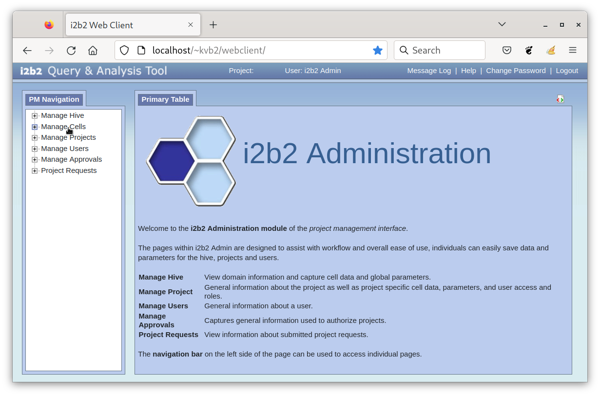
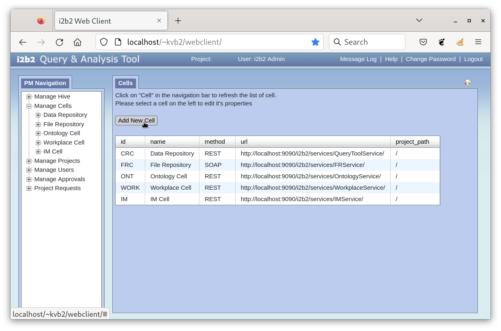
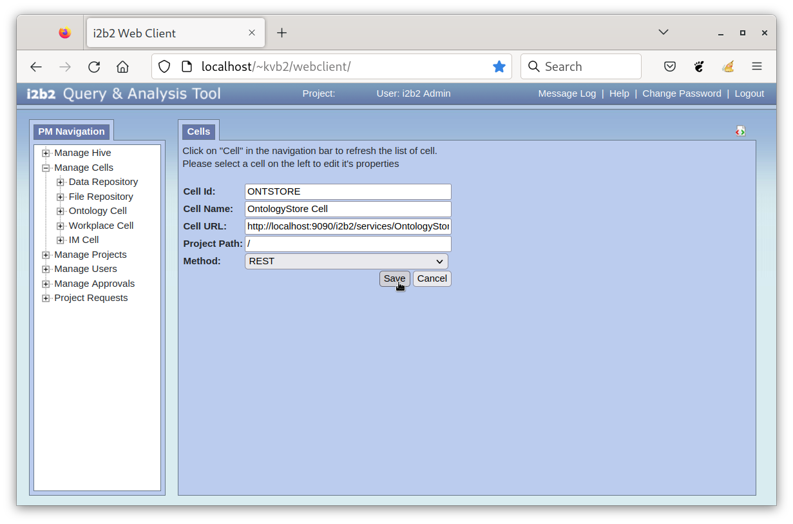
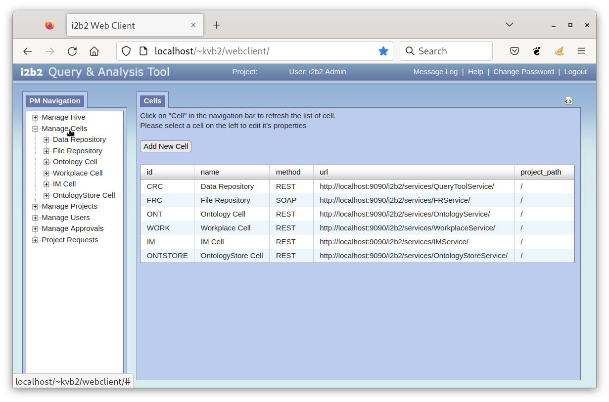

# OntologyStore Quick Installation Guide

A guide for installing the OntologyStore software.

## Prerequisites

### i2b2 System Requirements

- i2b2 Core Server 1.7.13 Release.
- i2b2 Webclient 1.7.13 Release.

### Required Permissions

- System administrator privileges is needed to install the OntologyStore plugin and to install the OntologyStore cell.
- i2b2 administrator privileges is needed to log into the i2b2 Administration Module to add new cell.

## Installing the OntologyStore Cell

The following instructions assume that the Wildfly directory on the server is **/opt/wildfly**.

### 1. Stop the Current Running Services

- Stop the Wildfly server running the i2b2 core server.

### 2. Download the OntologyStore Cell

- Click on the link to download [ontologystore_cell.zip](https://drive.google.com/file/d/1Pjkmc1AO2WWyg2jhUMrqn3PUZ8YmNHWS/view?usp=sharing).
- Extract ***ontologystore_cell.zip*** file.  Once the file has been unzipped, there should be two files (***OntologyStore.aar*** and ***OntologyStore.jar***) in the folder **ontologystore_cell**.

### 3. Add the Files to the i2b2 Cell on the Server

- Copy the aar file ***OntologyStore.aar*** from the **ontologystore_cell** folder to the Wildfly directory **/opt/wildfly/standalone/deployments/i2b2.war/WEB-INF/services**.

- Copy the jar file ***OntologyStore.jar*** **ontologystore_cell** folder to the Wildfly directory **/opt/wildfly/standalone/deployments/i2b2.war/WEB-INF/lib**.

> Note that the ***i2b2.war*** in the Wildfly directory **/opt/wildfly/standalone/deployments** may be an actual WAR file instead of a directory.  In this case, you will need to open up the ***i2b2.war*** file and add the ***OntologyStore.aar*** file to the **WEB-INF/services** folder and the ***OntologyStore.jar*** file to the **WEB-INF/lib** folder.

### 4. Configure the i2b2 OntologyStore Cell

- Create a file called ***ontologystore.properties*** in the Wildfly configuration directory **/opt/wildfly/standalone/configuration** with the following content:

```properties
ontology.dir.download=ontology_download_storage_directory

aws.s3.json.product.list=https://ontology-store.s3.amazonaws.com/product-list.json

# datasources
spring.hive.datasource.jndi-name=java:/OntologyBootStrapDS
spring.pm.datasource.jndi-name=java:/PMBootStrapDS
```

- Replace the ***ontology_download_storage_directory*** with the path to the directory where the ontologies should be downloaded to.  Note that ***Wildfly*** must have a read/write permission to that directory.

### 5. Restart the Services

- Restart the Wildfly server running the i2b2 core server.

## Installing the OntologyStore Plugin

The following instructions assume that the i2b2 webclient directory is **/var/www/html/webclient**.

### 1. Stop the Current Running Services

- Stop the web server running the i2b2 webclient.

### 2. Add the OntologyStore Cell

-  Click on the link to download [ONTSTORE.zip](https://drive.google.com/file/d/1P8nwjQOcvQEOqI9c6wmhD9WLHmZVNCHb/view?usp=sharing).

- Extract ***ONTSTORE.zip*** file to the i2b2 webclient directory **/var/www/html/webclient/js-i2b2/cells**.


### 3. Add the Plugin to the i2b2 Webclient

- Click on the link to download [ontologystore_plugin.zip](https://drive.google.com/file/d/1YqbbO-nFtcdfRXQWbaFAfdSBkXbQzGrY/view?usp=sharing).

- Extract ***ontologystore_plugin.zip*** file.  Once the file has been unzip, there should be a folder called **OntologyStore**.

- Copy the folder **OntologyStore**, extracted from the ***ontologystore_plugin.zip*** file, into the i2b2 webclient plugin directory **/var/www/html/webclient/js-i2b2/cells/plugins/community**.

### 4. Configure the i2b2 Webclient

- Add the following code to the array i2b2.hive.tempCellsList in the module loader configuration file ***i2b2_loader.js*** located in the directory **/var/www/html/webclient/js-i2b2**.

```js
{code: "ONTSTORE"},
{code: "OntologyStore",
    forceLoading: true,
    forceConfigMsg: {params: []},
    roles: [ "MANAGER" ],
    forceDir: "cells/plugins/community"
}
```

> Remember to make a backup copy of the file before modifying it.

### 5. Restart the Services

- Restart the web server running the i2b2 webcleint.

## Adding the OntologyStore Cell

The following instructions assume that the i2b2 Core Servers is deployed on the Wildfly server with the hostname ***localhost*** on port ***9090***.

### 1. Log into the i2b2 Administration Module.

### 2. In the Navigation panel, click on ***Manage Cells***.



### 3. In the Manage Cells page click on Add New Cell.



### 4. Enter the following cell information and click on the "Save" button:

| Field        | Value                                                     |
|--------------|-----------------------------------------------------------|
| Cell ID      | ONTSTORE                                                  |
| Cell Name    | OntologyStore Cell                                        |
| Cell URL     | http://localhost:9090/i2b2/services/OntologyStoreService/ |
| Project Path | /                                                         |
| Method       | REST                                                      |


> Note that the URL must end with a foward slash (**/**).

### 5. The cell will be added to the list of cells on the Manage Cells page.  In the Navigation panel click on Manage Cells to refresh the hierarchical tree and display the new cell:


