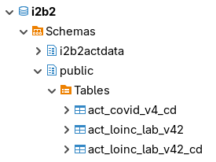
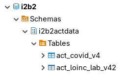
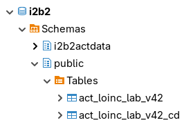
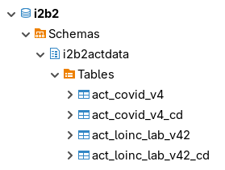
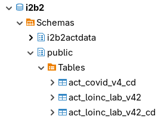
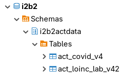

# OntologyStore Test Cases

This a documentation of test cases for downloading the ontologies from the clould and importing them into the i2b2 database.

The tests consist of downloading the ontologies and importing them in multiple i2b2 projects.

The test will be performed on the following databases supported by i2b2:

- PostgreSQL
- Oracle
- SQL Server

The OntologyStore has two primary database datasources for creating tables and importing the ontology data into the i2b2 database:

- **OntologyStoreDataDS**: This datasource is responsible for creating a table for importing concept-dimension data.  It may add records into the i2b2 ***QT_BREAKDOWN_PATH*** table.

- **OntologyStoreMetadataDS**: This datasource is responsible for creating a table for importing ontology data (metadata).  It will add a record into the i2b2 ***TABLE_ACCESS*** table and may add records into the i2b2 ***SCHEMES*** table.

> The OntologyStore can have additional set of datasources for separate projects.

The following i2b2 projects will be used for testing:

- **Demo**: This is the ***main*** i2b2 project.
- **ACT**: This project is added to the i2b2 project.

> The projects are on different schemas.

### Test Indicators

| Key | Vaue           |
|-----|----------------|
| ✅  | Test Passed    |
| ❌  | Test Failed    |
| ⬜  | Not Yet Tested |

## Test Case 1: One Set of Datasources, CRC Data and Metadata on Same Project Schema

One set of datasources that can access both the Demo project and the ACT project.  Both CRC data and metadata will be imported on the same i2b2 project schema.

Datasources:

- **OntologyStoreDataDS** - can import CRC data on either the Demo project or the ACT project.
- **OntologyStoreMetadataDS** - can import metadata on either the Demo project or the ACT project.

Both CRC data and metadata will be imported on the same schema as the project.

### Example Install in PostgreSQL Database

| Demo Project                                  | ACT Project                                  |
|-----------------------------------------------|----------------------------------------------|
|  |  |

The ***ACT Laboratory Tests*** ontology is installed in the Demo project and the ACT project.  The CRC data (act_loinc_lab_v42_cd) and the metadata (act_loinc_lab_v42) are imported in both the Demo project schema and the ACT project schema.

The ***ACT COVID-19 Ontology*** ontology is installed in the ACT projects.  Both the CRC data (act_covid_v4_cd) and the metadata (act_covid_v4) are imported into the ACT project schema.

### Test Results

| Database   | Passed |
|------------|--------|
| PostgreSQL | ✅     |
| Oracle     | ✅     |
| SQL Server | ⬜     |

## Test Case 2: One Set of Datasources, CRC Data on Same Project Schema and Metadata on Separate Project Schema

One set of datasources that can access both the Demo project and the ACT project.  The CRC data for both projects will be imported to the main i2b2 project (Demo) schema.  The metadate for each project will be imported to their own project schema.

Datasources:

- **OntologyStoreDataDS** - can import CRC data ***only*** on the Demo project.
- **OntologyStoreMetadataDS** - can import metadata on either the Demo project or the ACT project.

### Example Install in PostgreSQL Database

| Demo Project                                  | ACT Project                                  |
|-----------------------------------------------|----------------------------------------------|
|  |  |

The ***ACT Laboratory Tests*** ontology is installed in the Demo project and the ACT project. The CRC data (act_loinc_lab_v42_cd) is imported in the Demo project schema while the metadata (act_loinc_lab_v42) is imported in the Demo project schema and in the ACT project schema.

The ***ACT COVID-19 Ontology*** ontology is installed in the ACT projects. The CRC data (act_covid_v4_cd) is imported into the Demo project schema and the metadata (act_covid_v4) is imported into the ACT project schema.

### Test Results

| Database   | Passed |
|------------|--------|
| PostgreSQL | ✅     |
| Oracle     | ✅     |
| SQL Server | ⬜     |

## Test Case 3: Two Sets of Datasources For Each Project, CRC Data and Metadata on Same Project Schema

Two sets of datasources, one set for the Demo project and one for the ACT project.

Datasources:

- **OntologyStoreDataDS** - can import CRC data ***only*** on the Demo project.
- **OntologyStoreMetadataDS** - can import metadata ***only*** on the Demo project.
- **OntologyStoreACTDataDS** - can import CRC data ***only*** on the ACT project.
- **OntologyStoreACTMetadataDS** - can import metadata ***only*** on the ACT project.

### Example Install in PostgreSQL Database

| Demo Project                                  | ACT Project                                  |
|-----------------------------------------------|----------------------------------------------|
|  |  |

The ***ACT Laboratory Tests*** ontology is installed in the Demo project and the ACT project.

The ***ACT COVID-19 Ontology*** ontology is installed in the ACT projects.

### Test Results

| Database   | Passed |
|------------|--------|
| PostgreSQL | ✅     |
| Oracle     | ✅     |
| SQL Server | ⬜     |

## Test Case 4: Two Sets of Datasources For Each Project, CRC Data on Same Project Schema and Metadata on Separate Project Schema

Two sets of datasources, one set for the Demo project and one for the ACT project.

Datasources:

- **OntologyStoreDataDS** - can import CRC data ***only*** on the Demo project.
- **OntologyStoreMetadataDS** - can import metadata ***only*** on the Demo project.
- **OntologyStoreACTDataDS** - can import CRC data ***only*** on the Demo project.
- **OntologyStoreACTMetadataDS** - can import metadata ***only*** on the ACT project.

### Example Install in PostgreSQL Database

| Demo Project                                  | ACT Project                                  |
|-----------------------------------------------|----------------------------------------------|
|  |  |

The ***ACT Laboratory Tests*** ontology is installed in the Demo project and the ACT project. The CRC data (act_loinc_lab_v42_cd) is imported in the Demo project schema while the metadata (act_loinc_lab_v42) is imported in the Demo project schema and in the ACT project schema.

The ***ACT COVID-19 Ontology*** ontology is installed in the ACT projects. The CRC data (act_covid_v4_cd) is imported into the Demo project schema and the metadata (act_covid_v4) is imported into the ACT project schema.

### Test Results

| Database   | Passed |
|------------|--------|
| PostgreSQL | ✅     |
| Oracle     | ✅     |
| SQL Server | ⬜     |