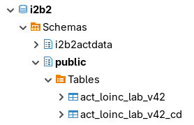
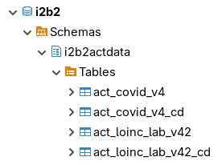

# OntologyStore Test Cases

This a documentation of test cases for downloading the ontologies from the clould and importing them into the i2b2 database.

The tests consist of downloading the ontologies and importing them in multiple i2b2 projects.

The test will be performed on the following databases supported by i2b2:

- PostgreSQL
- Oracle
- SQL Server

The OntologyStore has two primary database datasources for creating tables and importing the ontology data into the i2b2 database:

- **OntologyStoreDataDS**: This datasource is responsible for creating a table for importing concept-dimension data.  It may add records into the i2b2 ***QT_BREAKDOWN_PATH*** table.

- **OntologyStoreMetadataDS**: This datasource is responsible for creating a table for importing ontology data (metadata).  It will add a record into the i2b2 ***TABLE_ACCESS*** table and may add records into the i2b2 ***SCHEMES*** table.

> The OntologyStore can have additional set of datasources for separate projects.

The following i2b2 projects will be used for testing:

- **Demo**: This is the default i2b2 project that comes with the software.
- **ACT**: This project is added to the i2b2 project.

> The projects are on different schemas.

## Test Case 1: One Set of Datasources, Import All Same Schema

We will have one set of datasources:

- **OntologyStoreDataDS** - can import concept-dimension data on either the Demo project or the ACT project.
- **OntologyStoreMetadataDS** - can import metadata on either the Demo project or the ACT project.

Both concept-dimension data and metadata will be imported on the same schema as the project.

### Example Install in PostgreSQL Database

| Demo Project                                         | ACT Project                                         |
|------------------------------------------------------|-----------------------------------------------------|
|  |  |

The ***ACT Laboratory Tests*** ontology is imported in both the Demo project and the ACT project.

The ***ACT COVID-19 Ontology*** ontology is imported in the ACT project